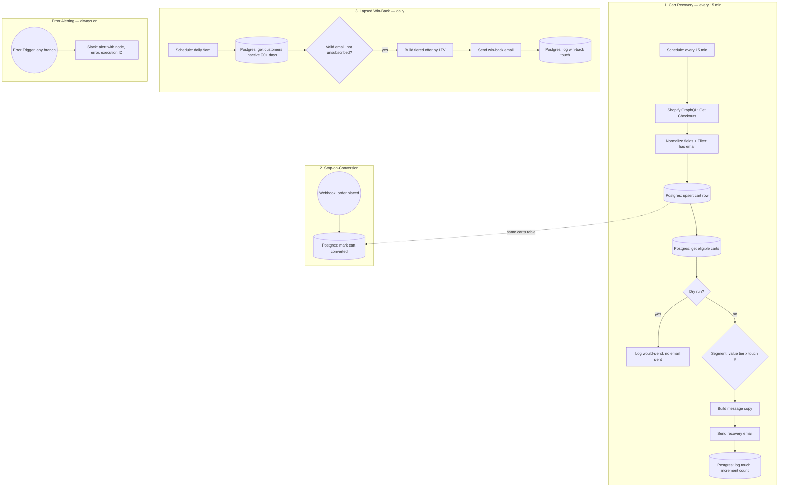

# Architecture

Three independent triggers feed one recovery/win-back system, sharing the
`carts` and `customers` tables as shared state. See [README.md](README.md)
for setup and troubleshooting.

## Why three separate triggers instead of one workflow

Each branch has a different cadence and a different failure mode, so they run
independently rather than being chained:

- **Cart Recovery (15 min)** needs to run often enough to catch a fresh
  abandonment, but is gated by its own spacing rules (`touch_count < 3`,
  20hrs+ since last touch) so frequency doesn't equal spam.
- **Stop-on-Conversion (webhook)** has to react in real time, the moment an
  order lands, not on the next 15-minute poll. Coupling it to the scan
  cadence would leave a window where a converted customer still gets a
  recovery email.
- **Lapsed Win-Back (daily)** operates on a completely different signal
  (90+ days of inactivity) and a completely different table relationship
  (`customers`, not `carts`). Bundling it into the cart-recovery scan would
  mean one bug in either logic path risks breaking both.

## Shared state, not shared logic

The `carts` table is the single source of truth both the recovery scan and
the conversion webhook read/write against. That's what makes
stop-on-conversion reliable, the webhook doesn't need to know anything about
segmentation or touch counts, it just flips `status = 'converted'` and the
next scan's `WHERE status = 'abandoned'` clause naturally excludes that row.
