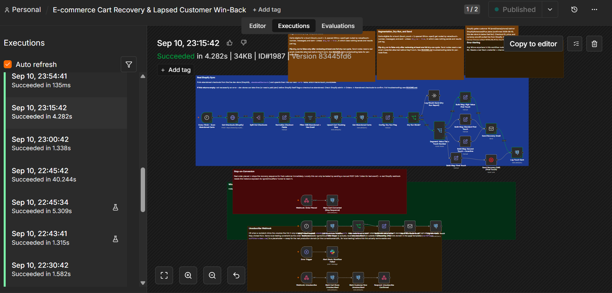
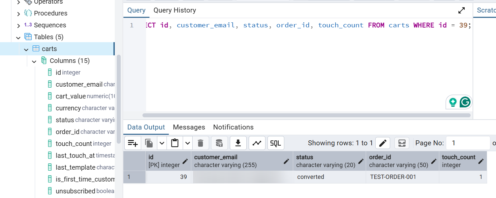
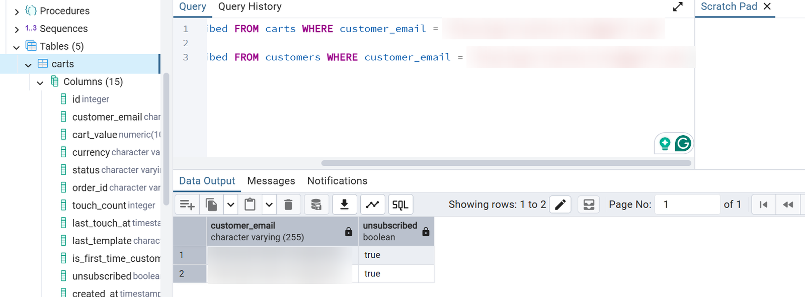

# E-commerce Cart Recovery & Lapsed Customer Win-Back

**Docs:** [Architecture](ARCHITECTURE.md) · [Business Case](BUSINESS-CASE.md) · [Deployment Notes](DEPLOYMENT.md)

**Video walkthrough:** [Watch the walkthrough on YouTube](https://youtu.be/uWqLXVScrWA)

## Screenshots

All records shown are test data.

*The n8n workflow with its execution history.*

*Stop-on-conversion: after the order webhook fires, the cart row shows status converted with the order ID attached.*

*Unsubscribe flag set to true on the cart and customer records.*

## What this is
A production-pattern automation, not a demo toy. It's a genericized rebuild of a
renewal/re-engagement recycling system pattern (originally proven in a different
industry, resold to multiple clients there) applied to e-commerce: recovering
abandoned carts and re-engaging lapsed customers, with the same production
discipline — dry-run mode, segmentation, stop-on-conversion, cross-channel
escalation, and failure alerting.

## Why not just use Klaviyo?
If you're already on Shopify + Klaviyo, Klaviyo's abandoned-cart flow covers
the basics, and this system isn't trying to replace that. It exists for two
other cases: stores that aren't on Shopify + Klaviyo (WooCommerce, a custom
stack, or Shopify without Klaviyo), and stores that need the layer most
off-the-shelf flows don't wire together out of the box — real-time
stop-on-conversion tied to an order webhook (not the next scheduled poll), a
final touch that escalates to SMS instead of another email, and a separate
lapsed-customer win-back tiered by lifetime value. Swapping the Shopify node
for a WooCommerce or custom-store API call is a same-shape change, not a
rebuild — see "What would change for a real client" below.

## Architecture
Three independent triggers feeding one recovery/re-engagement system:

1. **Every 15 min - Scan Abandoned Carts**: pulls carts abandoned 1hr+ with fewer
   than 3 touches sent, and at least 20hrs since the last touch (spacing prevents
   spamming). Segments by cart value and touch number into 4 branches (high-value
   first touch, standard first touch, incentive second touch, final touch).
2. **Webhook: Order Placed**: fires the moment a real order lands and immediately
   marks the matching cart as converted, which removes it from future scans. This
   is the "stop annoying people who already bought" logic that's easy to skip and
   expensive to skip.
3. **Daily - Scan Lapsed Customers**: separate cadence for customers with no
   purchase in 90+ days, tiered win-back offer by lifetime value, capped so the
   same customer isn't re-touched more than once every 60 days.

## Why it's built this way (the parts that matter to a client)
- **Dry-run mode is a config flag, not a code change.** New automations should be
  provable before they touch real customers or send real emails — flip one
  boolean, review the "would-send" log, then go live.
- **Segmentation lives in the workflow, not hardcoded per-customer.** Value tier
  and touch number drive both the offer and the copy, so adding a new segment
  later is a Switch rule, not a rebuild.
- **Conversion stops the sequence immediately.** No customer gets a "come back!"
  email after they already came back. This is the single most common bug in
  cart-recovery automations built without a real order-events webhook.
- **Failures alert instead of failing silently.** An Error Trigger branch pushes
  node name, error message, and execution ID to Slack — the team finds out from
  the alert, not from a customer complaint.

## Setup
1. Import `workflow.json` into n8n.
2. Run `schema.sql`, then `migration_shopify_sync.sql`, then
   `migration_add_customer_phone.sql` against Postgres (dummy seed data,
   the column that links tracked carts to real Shopify checkouts, and the
   phone column used by the final-touch SMS escalation).
3. Connect a Shopify API credential (Admin API access token from a custom app,
   scopes: checkouts, orders, customers, products, inventory, fulfillments),
   your own Postgres, SMTP/email, and Slack credentials.
4. Leave `dry_run = true` in the "Config: Dry Run Flag" node for at least one full
   cycle before flipping it to `false`.

## What would change for a real client
- Shopify credential swaps to the client's own store/token; WooCommerce or a
  custom store would swap the `Get Checkouts (Shopify)` node for that
  platform's API instead.
- **If the client already runs an email marketing platform** (Klaviyo,
  Mailchimp, ActiveCampaign, etc.), the right move usually isn't replacing it
  — it's keeping this system's segmentation, stop-on-conversion, and
  SMS-escalation logic (the parts their platform's own flow builder can't
  do) and swapping the raw SMTP send for a call to that platform's own
  API/events endpoint to trigger the actual send. Their platform already
  owns sender reputation, deliverability, and compliance tooling; no reason
  to rebuild that from scratch when the client is already paying for it.
- **If the client has no such platform**, raw SMTP (or SendGrid/Postmark for
  better deliverability than raw SMTP alone) is the right call, which is
  what this build demonstrates directly.
- Segmentation rules and copy get tuned to the client's actual price points and
  brand voice.

## Debugging & Troubleshooting (runbook)

General checklist before digging into a specific node:
- Are all three Docker containers running? `docker ps` should show `n8n`,
  `app-db`, `pgadmin` all "Up."
- Are credentials selected on every node? Re-importing a workflow drops
  credential bindings — they need to be reselected node by node.
- For any Postgres node error, run the same query directly in pgAdmin's Query
  Tool — Postgres's own error message is almost always clearer than n8n's.
- Check n8n's **Executions** list (left sidebar) for the full error stack of
  any past run.

| Node | What it does | Common errors | Where to check | Fix |
|---|---|---|---|---|
| Every 15min - Scan Abandoned Carts | Kicks off the cart-recovery scan on a schedule | Doesn't fire at all | Workflow must be **Active** (top-right toggle); n8n container running | Activate workflow; `docker ps` |
| Get Checkouts (Shopify) | Pulls abandoned checkouts from the real store via GraphQL | 401/403 auth error; GraphQL `errors` array (e.g. `undefinedField`); empty `edges` with no error | Node's Output → JSON tab | Auth error → recheck Shopify credential/token, reinstall app if scopes changed. `undefinedField` → field name wrong, adjust query. Empty with no error → data not populated yet (dev-store plan gating, or checkout not old enough) |
| Split Out Checkouts | Turns the API response into one item per checkout | "No field to split" | Compare Input vs Output tab shape | Field path must match the actual response shape (`abandonedCheckouts.edges`) |
| Filter: Still Abandoned + Has Email | Drops completed checkouts / checkouts with no email | Everything filtered out unexpectedly | Toggle filter off, inspect raw incoming item fields | Field names must match exactly (e.g. `customer.email`, not `email`) |
| Upsert Cart Tracking Row | Writes/updates a state row per checkout in our own `carts` table | "column does not exist"; "null value violates not-null constraint"; connection refused | pgAdmin — run the same INSERT manually | Missing column → run `migration_shopify_sync.sql`. Null value → source item missing email/price. Connection refused → Postgres credential host must be `app-db`, not `localhost` |
| Get Abandoned Carts | Pulls carts eligible for a touch (segmentation-ready) | Empty result even though rows exist | Run the same SELECT in pgAdmin, remove WHERE conditions one at a time | Row usually fails one condition — too new, already touched recently, or unsubscribed |
| Config: Dry Run Flag / Dry Run Mode? | Single switch gating whether emails actually send | Branch seems flipped | Check the boolean value in the Set node | Set `dry_run` to `true`/`false` as intended |
| Segment: Value Tier x Touch Number | Routes each cart to the right message variant | Item disappears (no output) | Compare the item's `touch_count`/`cart_value` against the Switch rules | `fallbackOutput: none` silently drops non-matching items — add a rule or a fallback branch |
| Build Msg: * (Set nodes) | Builds subject/template/discount per segment | Wrong copy appears | Check which Switch branch actually fired | Usually a segmentation bug upstream, not this node |
| Send Recovery Email / Send Win-Back Email | Sends the actual email | Fails until a real SMTP/email credential is attached; auth errors | Node's error output; email provider's send logs | Set up and select a real email credential |
| Send Recovery SMS (Final Touch) | Escalates the last touch to SMS via Twilio | Auth error → credential not selected (re-importing drops it, same as other nodes); trial-account error → recipient not a Verified Caller ID; `last_template` ends up blank in Postgres after this branch fires | Node's error output for Twilio auth/trial errors; check the `carts` row's `last_template` column after a test run for the blank-value case | Select the Twilio credential; verify the recipient number under Twilio Console → Verified Caller IDs; if `last_template` is blank, the Twilio node isn't passing the incoming `template` field through to Log Touch Sent — confirm by checking this node's output data, and if so change `Log Touch Sent`'s query to read the value via the upstream node lookup instead of `$json.template` |
| Log Touch Sent / Log Win-Back Touch | Updates touch_count/timestamps so a cart/customer isn't re-touched too soon | Column errors | Same as other Postgres nodes | Confirm `schema.sql`/migration ran fully |
| Webhook: Order Placed | Stops the recovery sequence the instant a real order lands | Real Shopify webhook can't reach local Docker | n8n's "Listen for test event" mode | Local testing: send a manual POST. Real use: needs an ngrok/Cloudflare tunnel exposing n8n publicly |
| Mark Cart Converted | Flips a cart to converted, removing it from future scans | Same Postgres error classes | pgAdmin | Confirm migration ran, credential correct |
| Error Trigger → Alert Slack: Workflow Failed | Catches any failure anywhere in the workflow and posts to Slack | Alert itself doesn't fire | Slack app permissions, channel name/ID | Reconnect Slack credential, confirm bot is in the target channel |
| Webhook: Unsubscribe → Mark Cart Rows Unsubscribed → Mark Customer Row Unsubscribed | Handles a recipient clicking "Unsubscribe" in any email; silences both tables | Link goes nowhere externally | Same as the order webhook — needs ngrok/Cloudflare Tunnel exposure to be reachable from outside this machine | Start a tunnel, update the placeholder domain in the email templates to match, re-test |
